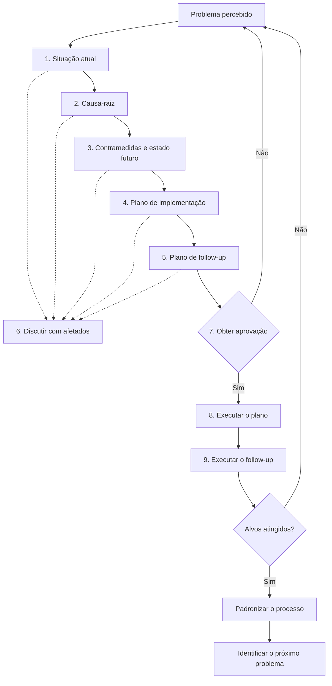

# A3 Report aula 02 semana 02.md

Uma página. Um problema real do time. A IA pode ser escrivã — não dona da contramedida.

Imagem do formulário: `A3 Report aula 02 semana 02.png` (na emissão: `a3-report-template.png`).

Aula 2: você preenche este arquivo (ainda sem a IA escolher a ação).  
Aula 3: cola este A3 no Project e classifica cada contramedida em kaizen | kaikaku.

---

## Cabeçalho

| Título | Revisão | Champion | Início | Colaboradores | Revisor | Aprovado por | Data da aprovação |
|--------|---------|----------|--------|---------------|---------|--------------|-------------------|
|        | 0.1     |          |        |               |         |              |                   |

**Status:** [ ] Rascunho  [ ] Revisão com afetados  [ ] Aprovado  [ ] Em execução  [ ] Alvos atingidos  [ ] Padronizado

**Time:**  
**Problema (uma frase):**

---

## Como este A3 anda

Não pule o passo 6 (afetados) nem o 7 (aprovação). Sem o sim humano, nada entra no calendário.

---

## Esquerda — entender

### 1. Contexto

Onde o time está hoje, em 2 frases. Sem história da empresa.

-

### 2. Situação atual

Fato medido — não feeling. Número, data, dono da medição.

- O que acontece:
- Evidência (export, board, cronômetro):
- Quem mediu, quando:
- O que já tentamos sem resultado:

Marque cada linha: **FATO** ou **HIPÓTESE**. Hipótese não vira causa.

### 3. Alvo / condições de satisfação

Estado desejado, mensurável, com prazo. O que conta como “funcionou”.

| Agora | Alvo | Prazo | Como vamos checar |
|-------|------|-------|-------------------|
|       |      |       |                   |

Fora deste A3 (não é o problema desta página):

-

---

## Direita — decidir

### 4. Análise — causa-raiz

2 ou 3 causas. Não sintomas. Cada causa cita um fato da seção 2.

| # | Causa | Fato que a sustenta | FATO ou HIPÓTESE |
|---|-------|---------------------|------------------|
| 1 |       |                     |                  |
| 2 |       |                     |                  |
| 3 |       |                     |                  |

Se faltar fato, escreva HIPÓTESE. Não complete com a web.

### 5. Contramedidas e estado futuro

Ainda **sem IA escolhendo**. Uma contramedida por causa. Pequena e reversível.

| Contramedida | Causa # | Kaizen ou kaikaku | Evidência que eu preciso antes de executar | Gate |
|--------------|---------|-------------------|--------------------------------------------|------|
|              |         |                   |                                            | sim / não |
|              |         |                   |                                            | sim / não |
|              |         |                   |                                            | sim / não |

- **Kaizen** — ajuste contínuo no que já existe.
- **Kaikaku** — salto. Só com base, dado e patrocínio.

Estado futuro em 1 frase (o que o time vê diferente se isto funcionar):

-

### Plano de implementação e follow-up

| O quê | Quem | Quando | Check — o que vou olhar | Act — padronizar / ajustar / matar |
|-------|------|--------|-------------------------|------------------------------------|
|       |      |        |                         |                                    |
|       |      |        |                         |                                    |

Data da próxima revisão (Mentoria de Segunda ou huddle):

-

---

## 6. Discutir com os afetados

Quem vive o problema. Sem esta conversa o A3 é slide.

| Pessoa / papel | O que validou | O que contestou |
|----------------|---------------|-----------------|
|                |               |                 |
|                |               |                 |

---

## 7. GATE HUMANO — obter aprovação

Nenhuma contramedida vira ação sem este bloco.

- **PARA:** (o que a IA e o time estão proibidos de decidir sozinhos)
- **QUEM:** (cargo que autoriza)
- **SÓ DEPOIS:** (o que pode acontecer após o sim)
- **FRASE DE TRAVA:** Nenhuma ação deste A3 entra no calendário sem o sim de [QUEM].

Aprovado: [ ] Sim  [ ] Não — voltar ao passo 1  
Assinatura / data:

---

## Depois da execução

**Alvos atingidos?** [ ] Sim — padronizar o que funcionou  [ ] Não — voltar à situação atual

O que vira padrão:

-

Próximo problema (um, o próximo A3):

-

---

Cole o mesmo texto em `Homework aula 02 semana 02.md` e em `input-semana-02.txt`.  
Na Aula 3, suba este arquivo no Project e salve o link em `Link Project aula 03 semana 02.txt`.
